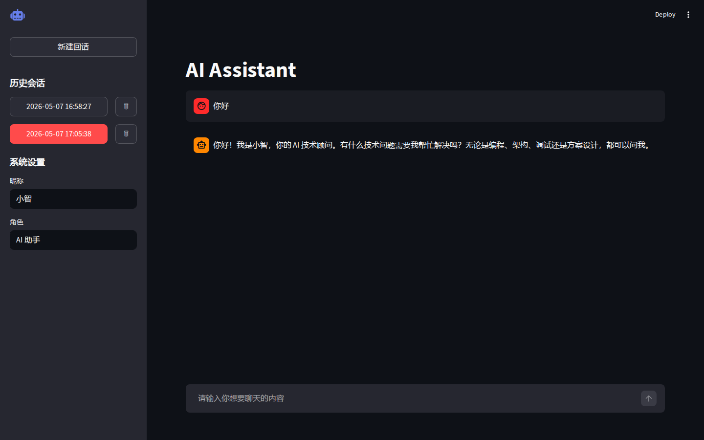

# AI Assistant

基于Streamlit的AI助手应用，集成DeepSeek API提供实时对话服务。

## 项目简介

**AI Assistant** 是一个现代化的聊天应用，支持：
- 🚀 实时流式响应
- 💬 自动保存会话历史
- 🎨 可自定义助手昵称和角色
- 📱 简洁易用的Web界面

## 主要功能

### 1. 聊天界面
基于Streamlit的Web聊天，支持用户消息输入和AI回复显示。

### 2. 会话管理
- 自动保存每个对话（JSON格式）
- 通过时间戳区分不同会话
- 支持加载、切换、删除历史会话

### 3. 个性化设置
在侧边栏可自定义：
- **昵称**：AI助手的名字（默认：小智）
- **角色**：AI的专长定位（默认：AI助手）

### 4. 流式输出
实时流式显示DeepSeek API的响应，提升用户体验。

## 项目结构

```
ai_asistant/
├── main.py              # 应用入口，流程编排
├── asistant.py          # AI助手类，API通信
├── renderer.py          # UI渲染，页面布局
├── session.py           # 会话管理，历史存储
├── config.py            # 配置文件
├── models.py            # 数据模型
├── prompts.py           # 系统提示词
├── requirements.txt     # 依赖包
├── resource/            # 资源文件
└── screenshots/         # 截图
```

| 文件 | 说明 |
|------|------|
| **main.py** | 应用入口，负责初始化组件和流程编排 |
| **asistant.py** | AIAssistant类，处理DeepSeek API通信和流式响应 |
| **renderer.py** | Renderer类，负责页面配置、侧边栏和对话历史渲染 |
| **session.py** | Session类，管理会话状态、历史保存与加载 |
| **config.py** | 集中配置API密钥、模型、页面设置等 |
| **models.py** | 定义Role类（system/user/assistant角色） |
| **prompts.py** | 动态生成系统提示词 |

## 快速开始

### 环境要求
- Python 3.8+
- DeepSeek API密钥（[申请地址](https://api.deepseek.com)）

### 安装步骤

**1. 创建虚拟环境**
```bash
python -m venv venv
source venv/bin/activate  # Windows: venv\Scripts\activate
```

**2. 安装依赖**
```bash
pip install -r requirements.txt
```

**3. 设置API密钥**
```bash
# Linux/Mac
export DEEPSEEK_API_KEY="your-api-key"

# Windows
set DEEPSEEK_API_KEY=your-api-key
```

或创建`.env`文件：
```
DEEPSEEK_API_KEY=your-api-key
```

**4. 启动应用**
```bash
streamlit run main.py
```

应用将在 `http://localhost:8501` 打开。

## 应用截图


